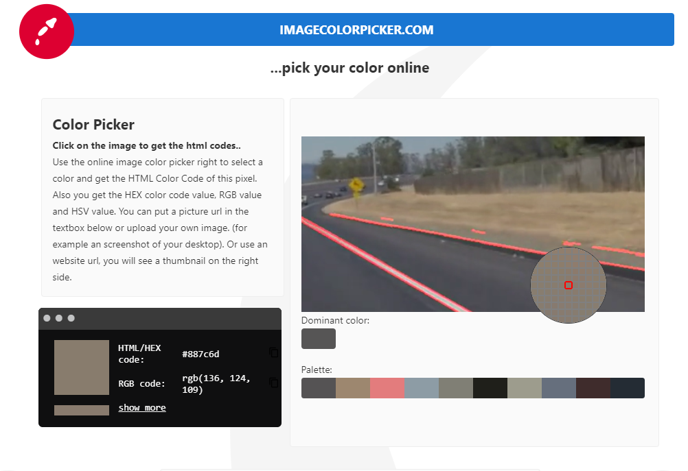

# Line detection with Canny Filter and Hough Transform on streamed-video
https://www.youtube.com/watch?v=o4SDztEzwpo
    
In this tutorial, we apply the same technic based on Canny Filter and Hough Transform to detect lines.  
*My previous tutorial on line-detection based on Canny Filter and Hough Transform of a static image*
https://github.com/nguyenrobot/line_detection_by_canny_gausian_hough  

This time we will try to detect lane's lines of a streamed video instead of a static image.

Our processing consist of (for the first part of this tutorial) :
- [x] Colour selection, try to keep white and yellow pixels
- [x] Gaussian filter with small kernel size to detect even blurred lines in far left/right side
- [x] Canny edge detection with small values of threshold to detect even blurred lines in far left/right side
- [x] Zone of interest filtering, to eliminate non-desired detections
- [x] Probabilistic Hough Transform with small values of minLineLength, maxLineGap and minimum_vote to be able to detect dashed-lines in far left/right side

*Author : nguyenrobot*  
*Copyright : nguyenrobot*  
https://github.com/nguyenrobot

Preprocessed-video Credit : Udacity

*Main script : line_detection_by_canny_gausian_hough_streamedvideo.py*  
*Main jupytter notebook : line_detection_by_canny_gausian_hough_streamedvideo.ipynb*  

# Part 1 : Greedy Strategy, we try to detect everything with small thresholds and accept false-positive as a compromise

## We will work on road videos coming from Udacity.

If our algorithm is robust, it should detect :
*    Solid-line and dashed-line of ego-vehicle's lane
*    Road-edge line
*    Dashed-lines of next-lanes

## Let's see how far can we go...

Let's start with a basic video which contains sharp and clear white lines.
### solidWhiteRight

Let's take a try with a harder video which contains yellow solid-line and road-edge lines.
### solidYellowLeft

# Part 2 : Greedy Strategy with enhanced colour selection
We always want to detect dashed-lines on far right/left side where that become blurred and small in the video's frame.  
We will to keep our greedy strategy and try to make a better colour selection...

We introduce color_keep_range and color_remove_range.
    # Colour Selection
    
    # keep white and yellow pixels
    RGB_thd_keep = [([150, 150, 150], [255, 255, 255]), ([160, 160, 100], [255, 210, 140])]
    result, k                          = color_keep_range(result, RGB_thd_keep)
    
    # remove unwanted colours
    RGB_thd_remove = [([0, 0, 0], [215, 215, 180])]
    result, k                          = color_remove_range(result, RGB_thd_remove)

I used RGB pick to identify numerically [R G B] value of pixels that need to be removed :  color_keep_range
RGB pick &#8595;

We also put kernel_size at a higher value (15) to keep dirties on windshield out of line detection.

### solidWhiteRight

### solidYellowLeft

The result is much better, but we still have some false-positives. We will find more sophisticated method in my next tutorials.

#### now, let's take a challenge video

Our line detection algorithm with Canny Edge Detection and Hough Transform works badly on the challenge video with curve and many noises. we will need to find out a better method in my next tutorials.

# Wrapping up
- [x] **Color Selection**  
Our Color Selection is not perfect. A "colour" is perceived not only by R G B channels' absolute values but also by the ratio between them. We can easily enhance our function color_keep_range and color_remove_range by introducing ratio between R G B channels but it won't be intuitive and make thing more complicated. Thus, there is a very good alternative is to work with colour in HSL (Hue Saturation Lightness) or HSV (Hue Saturation Value).  
HSL Scale, Image Credit : https://en.wikipedia.org/wiki/HSL_and_HSV#/media/File:HSL_color_solid_cylinder_saturation_gray.png &#8595;  

We can precisely and intuitively remove unwanted colour in HSL or HSV scale.
- [x] **Hough Transform vs Curve**  
As we can see in challenge video, our algorithm does not work in curves, it can only detect straight lines. We can extend our algorithm with Generalized Hough Transform to fit our curves with a 3-rd degree polynomial.
- [x] **Image distorsion**  
Further from the image frame's center, more the image is distorted. So, the lines in the far left/right side is more distorted by camera's optical systems and made it more difficult to identify. We should need a distorsion corrector filter by applying our line detection algorithm.
- [x] **Camera's perspective**  
From bird-eye view, lines/curve are parallel, but in camera's perspective they converge. That makes it more difficult to deteect line in the far left/right side, they are contracted and displayed smaller than lines in image frame's center. So, we will also need a perspective transform to have a bird-eye view of the image frame.  
Bird-eye view, Image Credit : M.Venkatesh, P.Vijayakumar, https://www.ijser.org/researchpaper/A-Simple-Birds-Eye-View-Transformation-Technique.pdf &#8595;  

These enhancements will be used in my next tutorials of advanced lines detection technics.
